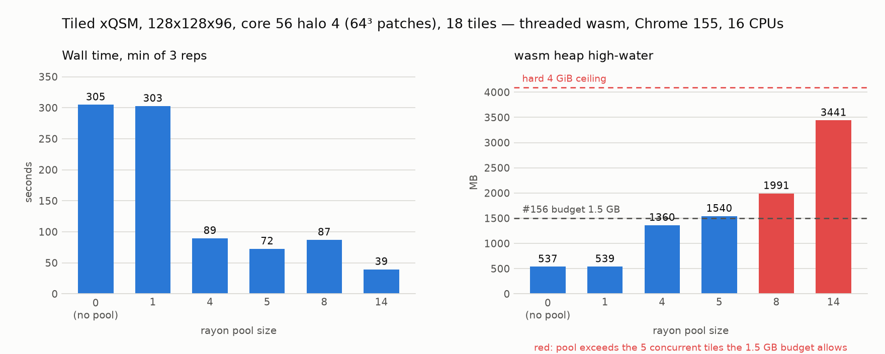

# 2026-10-07 — rayon pool size vs wall time and wasm heap, Neurodesk AMD EPYC Milan

Closes the timing half of [astewartau/QSM.rs#89](https://github.com/astewartau/QSM.rs/issues/89)
and settles the one open constant in
[astewartau/QSM.rs#156](https://github.com/astewartau/QSM.rs/pull/156) (the 1.5 GB wasm tile
activation budget).

**Conclusion: the 1.5 GB budget stands.** A pool of 14 is 1.84× faster than the pool of 5 the
budget allows, and it costs 2.2× the heap to get there — 3441 MB of a hard 4295 MB ceiling, on a
synthetic volume with nothing else in the heap. The speed-up is also wave-count quantisation, so
it is a property of this volume's tile count rather than a general gain. Details under
[Interpretation](#interpretation-against-156).



## What was measured

Tiled xQSM field inversion of a synthetic 128×128×96 volume with an all-ones mask (18 tiles) at
`core: 56, halo: 4` (64³ patches), sweeping the rayon pool size; whole-volume 64³ as a control;
and `core: 96, halo: 4` for the heap row. Three repetitions per configuration, back to back, in
one browser session, min-of-3 reported. One fresh module worker per configuration, so each heap
high-water is attributable to that configuration alone.

## Environment

| | |
|---|---|
| host | Neurodesk lab node, AMD EPYC-Milan, 64 cores / 245 GB; Slurm partition `neurodesktop` |
| allocation | 16 CPUs, 64 GB, one job (`cpu.max` = 16 cores; `nproc` still reports 64) |
| browser | Google Chrome for Testing 155.0.8059.39, `--headless=new`, no `--no-sandbox` |
| `navigator.hardwareConcurrency` | 64 (the node's, not the allocation's) |
| `crossOriginIsolated` | `true` in the page and `isolated=true` in every worker |
| bundle | QSMbly `7afc84c` + this branch's `run_bench.sh` changes, `./build.sh --simd` (threaded) |
| rustc | `1.101.0-nightly (ea137335b 2026-10-05)`, `-Z build-std`, `+atomics,+bulk-memory,+mutable-globals,+simd128` |
| wasm-pack | 0.13.1; wasm-opt `-O2 --enable-threads --enable-bulk-memory --enable-mutable-globals --enable-simd` |
| host C compiler | conda-forge gcc 16.2.0 (env `cc`); no system compiler on this machine |
| qsm-core | `rust-wasm/Cargo.toml` pins tag **v0.38.0**, then `[patch]`es it to **stebo85/QSM.rs rev `30df24f8`** — v0.38.0 plus exactly one commit (RS2-Net rodent BET; touches `bet/`, the registry and pipeline masking, **not** the tiled inversion). Equivalent to v0.38.0 for the tiled DL path. |
| cap under test | none — the compiled `inversion/tiled.rs` has no `tile_concurrency`; it runs `let batch = rayon::current_num_threads().max(1)`. This is the **uncapped** behaviour #156 proposes to bound. |
| weights | `https://huggingface.co/qsmxt/qsm-onnx-weights/resolve/main/xqsm.onnx`, 20 901 826 B, sha256 `81854ec2ca85bba25c2f9aae05efdcac299d0efffb03fe6a0e6797019e46b487`, downloaded once and served from localhost so every repetition reads identical bytes |

Slurm jobs: build `4` (COMPLETED 0:0, 21:44), sweep `7` (COMPLETED 0:0, 1:17:51). Sweep `6`
(1:18:11) is an independent repeat of the same plan whose numbers appear below as a cross-check.

## Commands

```bash
# build (threaded + SIMD), inside the allocation
export BINARYEN_CORES="${SLURM_CPUS_PER_TASK:-16}"      # see "What had to be fixed"
./build.sh --simd

# noise floor, same job and same window as the sweep
cc -O1 -o ctl scripts/bench-dl-threading/ctl.c
for i in $(seq 8); do ./ctl; done

# sweep
python3 scripts/bench-dl-threading/serve.py 8099 &
CHROME=~/.cache/chrome-for-testing/chrome/linux-155.0.8059.39/chrome-linux64/chrome \
scripts/bench-dl-threading/run_bench.sh '[
 {"mode":"tiled","threads":14,"reps":3,"weightsUrl":"/models/xqsm.onnx"},
 {"mode":"tiled","threads":8,"reps":3,"weightsUrl":"/models/xqsm.onnx"},
 {"mode":"tiled","threads":5,"reps":3,"weightsUrl":"/models/xqsm.onnx"},
 {"mode":"tiled","threads":4,"reps":3,"weightsUrl":"/models/xqsm.onnx"},
 {"mode":"tiled","threads":1,"reps":3,"weightsUrl":"/models/xqsm.onnx"},
 {"mode":"tiled","threads":0,"reps":3,"weightsUrl":"/models/xqsm.onnx"},
 {"mode":"whole","nx":64,"ny":64,"nz":64,"threads":14,"flag":true,"reps":3,"weightsUrl":"/models/xqsm.onnx"},
 {"mode":"whole","nx":64,"ny":64,"nz":64,"threads":14,"flag":false,"reps":3,"weightsUrl":"/models/xqsm.onnx"},
 {"mode":"whole","nx":64,"ny":64,"nz":64,"threads":0,"flag":false,"reps":3,"weightsUrl":"/models/xqsm.onnx"},
 {"mode":"tiled","core":96,"halo":4,"threads":4,"reps":1,"weightsUrl":"/models/xqsm.onnx"}
]' 25200 8099
```

## Noise floor — read this before the timings

`ctl.c`, 8 runs, in the sweep's own job immediately before the browser started:

| job | runs (s) | min | max | spread |
|---|---|---|---|---|
| 7 (the reported sweep) | 1.59, 1.60, 1.59, 1.60, 1.60, 1.60, 1.61, 1.60 | 1.59 | 1.61 | **1.3 %** |
| 6 (repeat) | 1.60, 1.60, 1.60, 1.82, 1.59, 1.59, 1.60, 1.60 | 1.59 | 1.82 | 14.5 % (one outlier; 7 of 8 within 1.59–1.60) |

**1.3 %**, against pool-size differences of 20–670 %. The effect is measured. This is the machine
#89 asked for: the laptop the issue was raised on ranged 1.03–11.18 s for the same fixed work.

The browser timings are correspondingly stable — the three repetitions of every configuration
agree to within 4 %, and jobs 6 and 7 agree to within 1 % on every min-of-3.

## Sweep — tiled xQSM, 128×128×96, core 56 halo 4 (64³ patches, 18 tiles)

Every repetition, job 7:

| pool | rep0 (s) | rep1 (s) | rep2 (s) | **min of 3** | vs pool 0 | heap high-water | waves (s) |
|---|---|---|---|---|---|---|---|
| 14 | 41.1 | 39.4 | 39.7 | **39.4** | 7.73× | 3441 MB | 18.5, 17.8 |
| 8 | 87.8 | 87.6 | 86.9 | **86.9** | 3.51× | 1991 MB | 33.0, 33.2, 16.9 |
| 5 | 72.9 | 72.5 | 72.8 | **72.5** | 4.20× | 1540 MB | 17.3, 17.1, 17.1, 16.9 |
| 4 | 89.6 | 89.4 | 89.4 | **89.4** | 3.41× | 1360 MB | 17.2, 17.0, 17.1, 17.1, 16.8 |
| 1 | 303.7 | 302.9 | 302.6 | **302.6** | 1.01× | 539 MB | 18 × ~16.6 |
| 0 (no pool) | 306.2 | 304.7 | 306.0 | **304.7** | 1.00× | 537 MB | 18 × ~16.8 |

Job 6, the independent repeat of the same plan:

| pool | rep0 (s) | rep1 (s) | rep2 (s) | **min of 3** | heap high-water |
|---|---|---|---|---|---|
| 14 | 41.2 | 39.6 | 39.6 | **39.6** | 3343 MB |
| 8 | 87.8 | 92.8 | 92.4 | **87.8** | 2040 MB |
| 5 | 73.4 | 72.3 | 76.8 | **72.3** | 1466 MB |
| 4 | 89.7 | 89.3 | 89.6 | **89.3** | 1201 MB |
| 1 | 303.4 | 304.8 | 304.4 | **303.4** | 539 MB |
| 0 (no pool) | 306.9 | 305.5 | 306.3 | **305.5** | 537 MB |

Times reproduce to within 1 %. Heap high-water reproduces to within 13 % — it is an allocator
high-water mark, not a deterministic quantity, so treat it as a figure with a few percent of
slack rather than an exact one.

### Reading the waves

`pool = 0` and `pool = 1` put the per-tile cost on the table directly: **~16.7 s of
single-threaded work per 64³ tile**, 18 of them, and the two agree to 0.7 % — so the sequential
fallback and a one-thread pool cost the same, and the rayon machinery itself is free.

`tiled_scatter` runs `tiles.chunks(rayon::current_num_threads())`, so wall time is
`ceil(18 / pool)` waves and a wave is as expensive as its slowest tile:

| pool | waves | predicted (waves × 16.7 s) | measured | ratio |
|---|---|---|---|---|
| 14 | 2 | 33.4 | 39.4 | 1.18 |
| 8 | 3 | 50.1 | 86.9 | **1.73** |
| 5 | 4 | 66.8 | 72.5 | 1.09 |
| 4 | 5 | 83.5 | 89.4 | 1.07 |

Pools 4, 5 and 14 scale almost perfectly: a 14-wide wave costs 18.5 s against the 16.7 s one tile
costs alone, i.e. 14 tiles in 1.11× the time of one.

**Pool 8 is the exception, and it is reproducible**: its first two waves cost ~33 s each instead
of ~17 s, in all six repetitions across both jobs, making pool 8 *slower than pool 5* while using
29 % more heap. This is the shape of the erratic behaviour #89 reported — but it is not a
general property of threading here, it appears at one pool size with neighbours on both sides
behaving normally. No explanation is offered; it is recorded as an open observation.

## Whole-volume control — xQSM 64³

The issue's ~2.2× reproduces, and the sweep confirms it is `set_threads_ready_wasm` (tract's
intra-op threading) that produces it, not the pool:

| configuration | rep0 | rep1 | rep2 | **min of 3** | heap |
|---|---|---|---|---|---|
| pool 14, `threads_ready = true` | 8.7 | 7.9 | 8.0 | **7.9 s** | 522 MB |
| pool 14, `threads_ready = false` | 21.2 | 20.9 | 20.9 | **20.9 s** | 522 MB |
| pool 0, `threads_ready = false` | 21.6 | 21.7 | 21.7 | **21.6 s** | 493 MB |

**2.73×** (21.6 → 7.9 s), against the ~2.2× in #89. A pool with the flag off buys nothing
(20.9 vs 21.6 s), which is what the nesting guard predicts. Job 6: 8.1 / 20.8 / 21.7 s, 2.68×.

## Heap table

| tile config | pool | heap high-water | % of the 4 GiB ceiling | time |
|---|---|---|---|---|
| core 56, halo 4 (64³ patches) | 4 | 1360 MB (job 6: 1201 MB) | 32 % | 89.4 s |
| core 56, halo 4 (64³ patches) | 14 | 3441 MB (job 6: 3343 MB) | 80 % | 39.4 s |
| core 96, halo 4 (104³ patches) | 4 | **4239 MB** (job 6) | **98.7 %** | 90.3 s |

The first two rows sit above the figures in #156 (1098–1150 MB at pool 4, 2577–2827 MB at pool
14) but confirm their shape and the per-patch arithmetic.

The last row is worse here than the 3705 MB recorded in #156, and this run produced the failure
mode directly rather than inferring it:

* **job 6** completed one inference at `core: 96, pool: 4` in 90.3 s, with the heap at 4239 MB of
  a 4295 MB ceiling — 56 MB of headroom.
* **a second repetition in the same module instance never finished.** The heap could not grow
  past 4239 MB, the renderer dropped to ~1.5 of its 4 cores, and the configuration was killed by
  the harness's 1800 s timeout after reporting 1 of 4 tiles.
* **job 7 could not complete even the first repetition** of that configuration within 1800 s.

So `core: 96` at a 4-thread pool is not "93 % of the ceiling and therefore risky" — on this
machine it is already past the point where the run makes progress. It did not abort cleanly; it
stopped making progress, which is worse to diagnose. **Do not run `core: 96` at pool 14.**

## Checksums

**The sparse checksum was identical across every configuration of a given tiling, in both jobs.**

| volume / tiling | checksum | configurations covered |
|---|---|---|
| tiled 128×128×96, core 56 halo 4 | `-7.605027` | pools 14, 8, 5, 4, 1, 0 — 6 configurations × 3 reps × 2 jobs = 36 runs |
| whole-volume 64³ | `-1.314219` | pool 14 flag on, pool 14 flag off, pool 0 — 9 runs × 2 jobs |
| tiled 128×128×96, core 96 halo 4 | `-8.315231` | pool 4 |

Pool size and tract's threading flag do not change the result. (The three groups differ from each
other because they are different volumes and different tilings, not different threading.)

## Interpretation against #156

**Leave `WASM_TILE_ACTIVATION_BUDGET` at `1_500_000_000`. Do not change #156.**

1. **The budget is accurately calibrated.** It allows 5 concurrent tiles at a 64³ patch, reckoning
   5 × 269.5 MB = 1347 MB of activations. The measured heap high-water for exactly that
   configuration is **1540 MB (job 7) / 1466 MB (job 6)** — the activation sum plus the 13 MB
   base plus allocator slack. A constant expressed in activation bytes lands within a few percent
   of the heap it is meant to bound. Nothing here argues it is mis-scaled in either direction.

2. **The speed a wider pool buys is real but unaffordable.** Pool 14 is **1.84×** faster than
   pool 5 (72.5 → 39.4 s). It gets there by holding **3441 MB**, 2.2× the budget and **80 % of a
   4295 MB ceiling** — measured on a synthetic volume whose heap holds nothing but the model, one
   f64 field, one mask and the activations. A real QSMbly session additionally holds the loaded
   NIfTI, magnitude, mask, unwrapped phase and background-field intermediates in that same heap.
   Raising the budget to admit 14 tiles would leave under 850 MB for all of it.

3. **The ceiling is not a soft limit, and it is near.** `core: 96, halo: 4` at a pool of **4** —
   a tile core the settings modal offers, below its maximum of 192 — reached **4239 MB, 98.7 %
   of the ceiling**, and then stopped making progress entirely (above). This is the outcome the
   cap exists to prevent, and it is reachable today at a pool size QSMbly already uses.

4. **The gain is wave-count quantisation, so it does not generalise.** Wall time is
   `ceil(n_tiles / concurrency)` waves. 18 tiles over 5 is 4 waves; over 14 it is 2. The 1.84×
   is a property of *this volume having 18 tiles*. A volume with 10 tiles would see 2 waves at
   either 5 or 14 and gain nothing; a volume with 5 tiles would gain nothing. Trading a hard,
   heap-exhaustion abort for a speed-up that depends on the volume's tile count is a bad trade.

5. **5 is the best of the affordable sizes anyway.** Among pools 1, 4, 5 and 8, pool 5 is the
   fastest (72.5 s vs 89.4 at 4 and 86.9 at 8). The obvious compromise — raising the budget to
   ~2.2 GB to admit 8 tiles — would be **20 % slower than the current cap** while using 29 % more
   heap. The budget's choice of 5 sits on a local optimum, not merely on a safe shelf.

### Caveats

* Pools above 14 were not measured: the Slurm partition has 16 CPUs, so a pool of 14 is already
  near the allocation's core limit and the pool-14 figure may understate what 64 cores could do.
  That cuts *against* raising the budget, not for it — more cores would buy more speed only by
  holding proportionally more activations, and the 4 GB ceiling does not move.
* The heap high-water is an allocator mark and reproduced to 13 % between jobs; the conclusions
  above rest on 2× differences, not on its last digit.
* Everything here is xQSM, the heaviest of the tiled nets at 1028 B per patch voxel. A lighter
  net gets more tiles out of the same budget by construction, which is what makes the budget the
  right place for the constant.

## What had to be fixed to build and run on this machine

1. **`run_bench.sh` hardcoded `google-chrome-stable`.** Added a `CHROME` env override (default
   unchanged). `--no-sandbox` was not needed. *Kept in this branch.*
2. **`run_bench.sh`'s EXIT trap could fail the caller.** `pkill` then `rm -rf "$PROFILE"` races
   Chrome's own unlinking and exits non-zero with "Directory not empty"; bash hands an EXIT
   trap's status back as the script's status, so a completed bench reported failure to a `set -e`
   caller. The cleanup now tolerates it. *Kept in this branch.* (This cost one full sweep: job 6
   produced every measurement, logged `ALL DONE`, and still exited 1.)
3. **wasm-opt oversubscribed the CPU allocation 4:1.** binaryen sizes its thread pool from
   `/proc/cpuinfo` (64 here), not the cgroup the Slurm job is confined to (16). wasm-opt on the
   46 MB DL bundle ran **over 67 minutes without finishing**; with
   `export BINARYEN_CORES=16` the whole `./build.sh --simd` finishes in **21:44**. Not a QSMbly
   bug — worth knowing for any CPU-limited build host.
4. **No system C compiler.** `cc`, needed both for `ctl.c` and as cargo's host linker, comes from
   a conda env (`conda activate cc`, gcc 16.2.0). Must be active before any cargo/wasm-pack call.
5. **`ctl.c` exits 1 on success** (`return (int)(s > 0)`). Harmless interactively; it kills a
   `set -euo pipefail` harness. Not changed — the behaviour is deliberate and documented by the
   code — but any script running it must tolerate the status.
