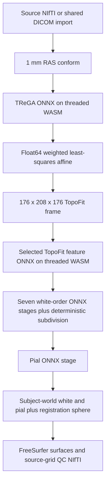

# TopoFit browser architecture

## Decision

Implement OpenRecon TopoFit 0.5.1 as a local imaging application backed by a reusable `@neurodesk/topofit` package. ONNX is the canonical exported model format. ONNX Runtime WebAssembly executes portable staged graphs in a worker; small Float64 affine and mesh-subdivision steps stay in JavaScript.

This is a staged hybrid because ONNX Runtime WebGPU cannot run the source model: its `Conv` implementation excludes 3-D convolution and BrainNet uses rank-5 sampling. Export-time lowerings express rank-5 trilinear sampling and indexed graph reductions with standard ONNX arithmetic, gather, scatter, and reduction operators. The application does not reduce the mesh order, approximate the graph, or send scans to a service.

The design was selected from two independent candidates. The staged candidate is the base. It gains the other candidate's exact source-grid QC, FreeSurfer output, and registration-sphere comparison rules. An independent judge found that both candidates' original WebGPU assumption was invalid. A subsequent full order-6 trace exhausted 32 GB of host memory, so the final split follows BrainNet's seven native mesh orders and validates every boundary separately.

## Public contract

The application calls one deep operation and does not know tensor names, model shapes, topology indices, coordinate transforms, cache keys, or GPU schedules.

```ts
export type TopofitModel = "t1w-1mm";

export type TopofitProgress = Readonly<{
  phase: "loading" | "aligning" | "reconstructing" | "writing";
  fraction: number;
  message: string;
}>;

export type TopofitFile = Readonly<{
  id:
    | "qc"
    | "lh-white"
    | "rh-white"
    | "lh-pial"
    | "rh-pial"
    | "lh-registration"
    | "rh-registration"
    | "provenance";
  name: string;
  mediaType: string;
  bytes: ArrayBuffer;
}>;

export type TopofitResult = Readonly<{
  files: readonly TopofitFile[];
  provenance: Readonly<Record<string, unknown>>;
}>;

export function runTopofit(request: Readonly<{
  buffer: ArrayBuffer;
  model: TopofitModel;
  conform: boolean;
  overlayThickness?: 0 | 1 | 2 | 3;
  onProgress?: (fraction: number, message: string) => void;
  // Browser boundary adapters for conforming, verified assets, and ONNX.
  conformImage: (buffer: ArrayBuffer) => Promise<ArrayBuffer>;
  loadAsset: (name: string) => Promise<ArrayBuffer>;
  createSession: (model: ArrayBuffer) => Promise<unknown>;
  Tensor: unknown;
}>): Promise<TopofitResult>;
```

The implementation parses untrusted image, worker-message, and release-manifest data at their boundaries. Internally, a surface value always carries its hemisphere, coordinate frame, order-6 face table, and 245,762 index-corresponding vertices together.

## Runtime flow



TReGA runs at `192 x 224 x 192`. Its ONNX artifact emits 32 subject-space targets, normalized feature masses, and learned template points. The runtime solves the same augmented weighted system for the whole-brain transform. Both sides are multiplied by feature mass, matching BrainNet 0.2; this is deliberately not changed to square-root weighting.

TopoFit runs at `176 x 208 x 176`. The image U-Net emits its four decoder maps once. Seven white-surface graphs preserve the source order-0 through order-6 schedule; exact DeepSurfer edge tables drive deterministic midpoint subdivision between them. One exported learned pial update is applied ten times by the browser, matching the checkpoint's recurrent schedule without duplicating weights. The export lowers PyTorch's rank-5 trilinear sampling with `align_corners=true`, graph neighbor means, and max pooling without changing learned convolution, normalization, or PReLU parameters.

One worker owns one run and its ONNX sessions. Sessions are released between stages, and cancellation terminates the worker when an inference call cannot be interrupted. A new run gets new mutable state and may reuse only completely downloaded, hash-verified cache entries.

## Ownership

| Location | Responsibility |
| --- | --- |
| `apps/topofit` | Canonical imaging-workspace UI, import, worker lifetime, viewing, and downloads. |
| `packages/topofit/src/index.js` | Single reconstruction facade and result contract. |
| `packages/topofit/src/volume.js` | NIfTI geometry, cropping, normalization, and coordinate transforms. |
| `packages/topofit/src/affine.js` | Float64 weighted affine solve. |
| `packages/topofit/src/qc.js` | Native-grid QC rasterization and NIfTI writing. |
| `packages/topofit/src/browser.js` | Threaded ONNX Runtime WebAssembly setup and session ownership. |
| `packages/topofit/src/pipeline.js` | Staged TReGA, feature, mesh-order, subdivision, and pial execution. |
| `packages/topofit/src/results.js` | FreeSurfer geometry and provenance serialization. |
| `packages/topofit/model.manifest.json` | Immutable Hugging Face revision, hashes, tensor contracts, topology identity, and provenance. |
| `packages/topofit/scripts` | Container capture, conversion, packing, parity, publication, and activation. |

The package is TopoFit-specific. Its scientific coordinate and topology rules are not promoted into a generic geometry layer without a second proven consumer.

## Output contract

Each hemisphere has 245,762 vertices and 491,520 faces. Vertex ordering, face arrays, and right-hemisphere winding must match the container exactly. White and pial vertices are written in the container's FreeSurfer surface frame. Registration output remains on its sphere and is never presented as anatomical RAS.

The QC NIfTI keeps the source dimensions, affine, qform, and sform. It reproduces the container's anatomy scaling, pial value 3500, white value 4095, white precedence, ties-to-even voxel rounding, and requested four-neighbor in-plane outline dilation. The viewer reads the same products that are offered for download.

## Artifact and activation contract

Large assets live below `topofit/0.5.1/` in the `neurodeskorg/webapps` Hugging Face dataset. A release contains:

- TReGA plus T1-weighted and reserved synthetic-contrast TopoFit ONNX graphs;
- exact template, face, adjacency, pooling, and subdivision tables;
- an export report with source versions and checkpoint hashes;
- licensed validation input, pinned-container outputs, stage captures, and reports;
- license and attribution notices.

The checked-in manifest pins an immutable Hugging Face commit and repeats every runtime byte count and SHA-256. Publication is one dataset commit. Activation happens only after anonymous re-download verifies every asset and all parity reports refer to the same release bytes. A partial upload therefore cannot activate a model.

## Proof order

1. Pin the OpenRecon image digest and capture the real neural workflow, not the mock path.
2. Compare PyTorch with CPU ONNX at each exported learned boundary.
3. Compare CPU ONNX with browser ONNX Runtime WebAssembly on the same tensors.
4. Compare conforming, feature masses, barycentres, affines, sampled features, graph reductions, each mesh order, and frame conversion with container captures.
5. Compare browser-produced surfaces by vertex index in the same frame. Require exact faces, vertex counts, winding, and finite values. Compare registration by angular error and radius.
6. Reopen every browser-generated FreeSurfer and NIfTI file independently and compare its geometry and values with the container output. Report exact sparse-label Dice, but gate QC on symmetric coverage within one source voxel because subvoxel surface differences can cross voxel-rounding boundaries.
7. Run a fresh production build, interface audits, mobile tests, workflow tests, and a real interactive reconstruction.

Tolerance values are recorded before activation and are never widened to turn a failed conversion green. Nearest-surface distance and screenshots are diagnostics; neither can replace vertex-correspondence and file-geometry checks.

The controlled `ds000001` comparison passed with 0.052–0.062 mm mean corresponding distance across the four anatomical surfaces, 0.028–0.041 degree mean registration error, exact face topology, and at least 0.9996 symmetric one-voxel QC coverage. The end-to-end comparison records the separate conformer effect as a measured difference: 0.467–0.562 mm mean surface distance for the browser's Niimath Lanczos path versus OpenRecon's nibabel cubic path.

## Tradeoffs

- The CPU WebAssembly executor is slower than a future custom WebGPU executor, but it keeps the first implementation portable, local, and directly tied to validated ONNX graphs.
- Fixed model shapes and topology make the runtime narrower and auditable. Only the validated T1-weighted preset is exposed; the exported synthetic-contrast graphs remain unavailable until they receive their own browser/container report.
- Optional flat-patch and sulcal-middepth analyses are outside the first reconstruction release. They are not claimed through surface parity and require their own tests before being added.
- Full order-6 reconstruction requires a desktop browser with WebAssembly threads and sufficient memory. Unsupported hardware receives a clear error; it does not receive a lower-quality result under the same name.

## First gate

Before registry activation, one reference brain must complete through the production browser worker with full order-6 topology and pass the controlled comparison against the pinned container. The production-preprocessing comparison must also be captured and reviewed, but it is not judged against the controlled inference thresholds because the two conformers intentionally use different interpolation kernels. Any measured difference stays visible in the checked-in report and the app remains explicitly experimental.
